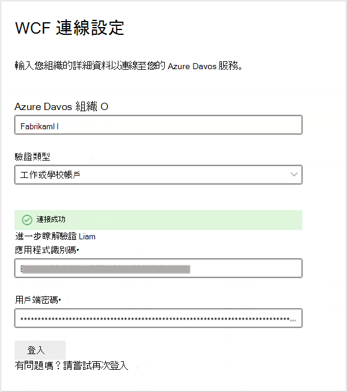

# Azure DevOps 連接器Azure DevOps connector

透過 Azure DevOps connector，您的組織可以在其 Azure DevOps 服務實例中編制工作專案的索引。With the Azure DevOps connector, your organization can index work items in its instance of the Azure DevOps service. 當您從 Azure DevOps 設定連接器和索引內容之後，使用者就可以在 Microsoft 搜尋中搜尋這些專案。After you configure the connector and index content from Azure DevOps, end users can search for those items in Microsoft Search.

本文適用于 Microsoft 365 系統管理員或任何設定、執行及監視 Azure DevOps 連接器的人員。This article is for Microsoft 365 administrators or anyone who configures, runs, and monitors an Azure DevOps connector. 它說明如何設定連接器和連接器功能、限制及疑難排解技術。It explains how to configure your connector and connector capabilities, limitations, and troubleshooting techniques.

>[!IMPORTANT]
>Azure DevOps 連接器只支援 Azure DevOps 雲端服務。The Azure DevOps connector supports only the Azure DevOps cloud service. Azure DevOps Server 2019，tfs 2018，tfs 2017，tfs 2015，及 TFS 2013 都不受此連接器支援。Azure DevOps Server 2019, TFS 2018, TFS 2017, TFS 2015, and TFS 2013 are not supported by this connector.

## 連接到資料來源Connect to a data source

若要連線至 Azure DevOps 實例，您需要 Azure DevOps [組織](https://docs.microsoft.com/azure/devops/organizations/accounts/create-organization) 名稱、其應用程式識別碼，以及 OAuth 驗證的用戶端密碼。To connect to your Azure DevOps instance, you need your Azure DevOps [organization](https://docs.microsoft.com/azure/devops/organizations/accounts/create-organization) name, its App ID, and client secret for OAuth authentication.

### 註冊應用程式Register an app

您必須在 Azure DevOps 中註冊應用程式，Microsoft 搜尋應用程式才能存取實例。You must register an app in Azure DevOps so that the Microsoft Search app can access the instance. 若要深入瞭解，請參閱 Azure DevOps 檔，以瞭解如何 [註冊應用程式](https://docs.microsoft.com/azure/devops/integrate/get-started/authentication/oauth?view=azure-devops#register-your-app)。To learn more, see Azure DevOps documentation on how to [register an app](https://docs.microsoft.com/azure/devops/integrate/get-started/authentication/oauth?view=azure-devops#register-your-app).

下表提供如何填寫 [應用程式註冊] 表單的指導方針：The following table provides guidance on how to fill out the app registration form:

 **必要欄位****Mandatory Fields** | **描述****Description**      | **建議值****Recommended Value**
--- | --- | ---
| 公司名稱Company Name         | 這是您公司的名稱。This is the name of your company. | 使用適當的值Use an appropriate value   |
| 應用程式名稱Application name     | 此唯一值可識別您要授權的應用程式。This unique value identifies the application that you're authorizing.    | Microsoft 搜尋Microsoft Search     |
| 應用程式網站Application website  | 此必要欄位是在連接器設定期間要求存取 Azure DevOps 實例之應用程式的 URL。This required field is the URL of the application that will request access to your Azure DevOps instance during connector setup.  | <https://gcs.office.com/>                |
| 授權回撥 URLAuthorization callback URL        | 授權伺服器重新導向所需的回撥 URL。A required callback URL that the authorization server redirects to. | <https://gcs.office.com/v1.0/admin/oauth/callback>|
| 授權範圍Authorized scopes | 這是應用程式的存取範圍This is the scope of access for the application | 選取下列範圍： Identity (讀取) 、工作專案 (讀取) 、變數群組 (讀取) 、專案和團隊 (讀取) 、圖形 (讀取) Select the following scopes: Identity (read), Work Items (read), Variable Groups (read), Project and team (read), Graph (read)|

在註冊具有上述詳細資料的應用程式時，您會取得將用來設定連接器的 **應用程式識別碼** 和 **用戶端密碼** 。On registering the app with the details above, you will get the **App ID** and **Client Secret** that will be used to configure the connector.

>[!NOTE]
>若要撤銷對 Azure DevOps 中註冊的任何應用程式的存取權，請移至 Azure DevOps 實例右邊的 [使用者設定]。To revoke access to any app registered in Azure DevOps, go to User settings at the right top of your Azure DevOps instance. 按一下 [設定檔]，然後按一下側邊窗格 [安全性] 區段中的 [授權]。Click on Profile and then click on Authorizations in the Security section of the side pane. 將游標移到授權的 OAuth 應用程式上，以查看應用程式詳細資料右下角的 [撤銷] 按鈕。Hover over an authorized OAuth app to see the Revoke button at the corner of the app details.

### 連接設定Connection settings

在使用 Azure DevOps 註冊 Microsoft Search 應用程式之後，您可以完成 [連線設定] 步驟。After registering the Microsoft Search app with Azure DevOps, you can complete the connection settings step. 輸入您的組織名稱、應用程式識別碼和用戶端密碼。Enter your organization name, App ID, and Client secret.

## 選取專案和欄位Select projects and fields

您可以選擇建立整個組織或特定專案之索引的連線。You can choose for the connection to index either the entire organization or specific projects.

如果您選擇編制整個組織的索引，組織中所有專案中的專案將會獲得索引。If you choose to index the entire organization, items in all projects in the organization will get indexed. 新專案和專案會在建立後的下一個編目期間編制索引。New projects and items will be indexed during the next crawl after they are created. 如果您選擇個別專案，則只有那些專案中的工作專案將會編制索引。If you choose individual projects, only work items in those projects will be indexed.

接下來，選取您要連線索引及預覽這些欄位中資料的欄位，然後再繼續進行。Next, select which fields you want the connection to index and preview data in these fields before proceeding.

## 管理搜尋結構描述Manage the search schema

設定搜尋架構對應。Configure the search schema mapping. 您可以選擇哪些屬性可供 **查詢**、可搜尋及可 **供\*\*\*\*檢索**。You can choose which properties to make **queryable**, **searchable** and **retrievable**.

## 管理搜尋許可權Manage search permissions

Azure DevOps 連接器目前只支援 **所有人皆可看到**搜尋許可權。The Azure DevOps connector currently only supports search permissions **Visible to Everyone**. 已編制索引的資料將會出現在所有使用者的搜尋結果中。Indexed data will appear in the search results for all users.

## 設定重新整理排程Set the refresh schedule

Azure DevOps 連接器支援完整和累加編目的更新排程。The Azure DevOps connector supports refresh schedules for both full and incremental crawls. 完整編目會找到先前同步處理至 Microsoft 搜尋索引的已刪除工作專案。A full crawl finds deleted work items that were previously synced to the Microsoft Search index. 會執行完整編目，以同步處理所有工作專案。A full crawl runs to sync all the work items. 若要將新的工作專案和更新同步到現有的工作專案，您必須排程累加編目。To sync new work items and updates to existing work items, you need to schedule incremental crawls.

建議的排程為一小時用於增量編目，而一天則是完整編目。The recommended schedule is one hour for an incremental crawl and one day for a full crawl.
